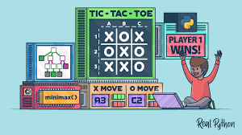

# TicTacToe
An unbeatable Tic-Tac-Toe game powered by the Minimax algorithm . Challenge yourself against a smart AI that never loses !

## Objective
Creating a Tic-Tac-Toe game where the user can play against an AI that uses the Minimax algorithm to make optimal moves. The AI is designed to never lose, ensuring either a win for the AI or a draw.

## Minimax Algorithm
The Minimax algorithm is a recursive method used in decision-making and game theory for minimizing the possible loss in a worst-case scenario. It calculates all possible moves in a game to find the optimal move for the player by assuming that the opponent also plays optimally.

## Language
- C++

## Dependencies
- None (Standard C++ libraries)

## Getting Started

### Prerequisites
- C++ compiler (e.g., g++, clang)

### Compilation and Running
-g++ -o TicTacToe src/main.cpp./TicTacToe

